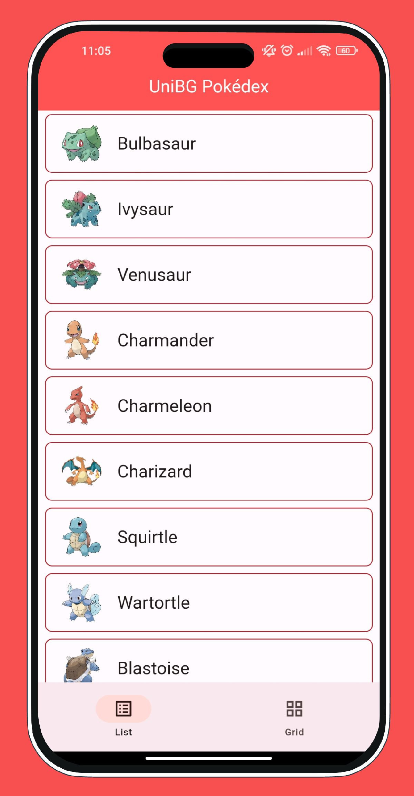
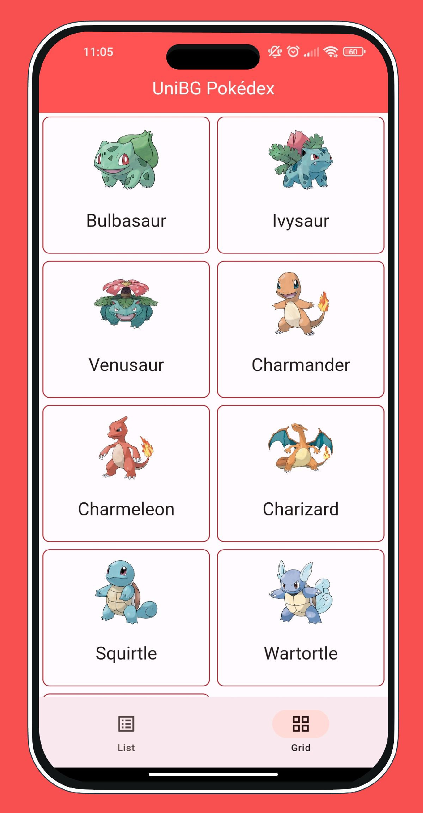
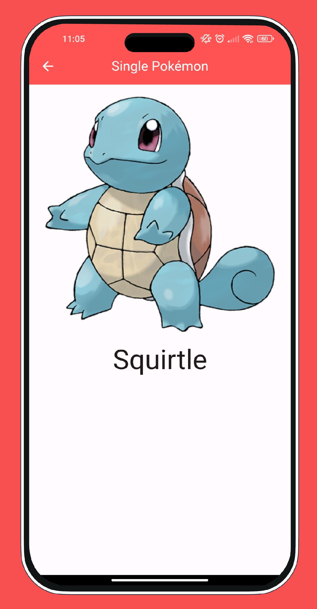

# UniBG Pokédex with Flutter

<p align="center">
    <a href="https://dart.dev/"></a>
    <a href="https://flutter.dev/"></a>
</p>

> Disclaimer: This repository is still under development and should not be considered a finished product. The code is subject to change and may not be complete or functioning properly.

This repository contains the source code of the demo [Pokédex](https://en.wikipedia.org/wiki/Gameplay_of_Pok%C3%A9mon#Pok%C3%A9dex) (ポケモン図鑑, Pokémon Zukan, lit.: Pokémon Encyclopedia) application that I made for the lecture given for the [Scuola di Ingegneria](https://www.unibg.it/embed-ingegneria/strutture-scuola-ingegneria) at the [University of Bergamo](https://www.unibg.it/). The application allows users to view the top 9 Pokémon in both list and grid format, navigate to their dedicated page, and view statistics.

Moodboard for the UI of the app: [Pokédex on Pinterest](https://www.pinterest.it/polilluminato/pokedex/)

### Compile

I used [freezed](https://pub.dev/packages/freezed) to handle the json responses coming back from the API, but the generated `*.freezed.dart` and `*.g.dart` files were not committed, so before starting the project you need to run `build_runner` in order to create them:

```sh
$ dart pub run build_runner build --delete-conflicting-outputs
```

## 📱 Screenshots

| Home List                            | Home Grid                            | Single Page                            |
|--------------------------------------|--------------------------------------|----------------------------------------|
|  |  |  |

## 💎 Contributing

If you have any idea, feel free to fork it and submit your changes back to me.

## 📋 License

UniBG Pokédex is released under the [MIT license](LICENSE.md). You can use the code for any purpose, including commercial projects.

[](https://opensource.org/licenses/MIT)