# UniBG Pokédex with Flutter

<p align="center">
    <a href="https://dart.dev/"></a>
    <a href="https://flutter.dev/"></a>
    <a href="https://opensource.org/licenses/MIT"></a>
    <br>
     <a href="https://github.com/polilluminato/unibg-pokedex-flutter"></a>
    <a href="https://github.com/polilluminato/unibg-pokedex-flutter/commits/main"></a>
    <a href="https://github.com/polilluminato/unibg-pokedex-flutter/pulls"></a>
    <a href="https://github.com/polilluminato/unibg-pokedex-flutter/issues?q=is%3Aissue+is%3Aopen"></a>
    <a href="https://github.com/polilluminato/unibg-pokedex-flutter/graphs/contributors"></a>
</p>

This repository contains the source code of the demo [Pokédex](https://en.wikipedia.org/wiki/Gameplay_of_Pok%C3%A9mon#Pok%C3%A9dex) (ポケモン図鑑, Pokémon Zukan, lit.: Pokémon Encyclopedia) application that I made for the lecture given for the [Scuola di Ingegneria](https://www.unibg.it/embed-ingegneria/strutture-scuola-ingegneria) at the [University of Bergamo](https://www.unibg.it/). The application allows users to view the first 151 Pokémon in both list and grid format, navigate to their dedicated page, and view statistics.

The [Flutter - Pokédex - UniBG](https://docs.google.com/presentation/d/1nJvaS6JzNPdh6aU2XAQoXEWMFffXNeyaAxlFsQpOcBI/edit?usp=sharing) slides can be found here.

Moodboard for the UI of the app: [Pokédex on Pinterest](https://www.pinterest.it/polilluminato/pokedex/)

## 📦 Packages

Here are the most interesting packages used in the development of the application with a brief description:

* [audioplayers](https://pub.dev/packages/audioplayers): A Flutter plugin to play multiple audio files simultaneously
* [flutter_animate](https://pub.dev/packages/flutter_animate): Add beautiful animated effects & builders in Flutter, via an easy, customizable, unified API
* (DISCONTINUED)[palette_generator](https://pub.dev/packages/palette_generator): Flutter package for generating palette colors from a source image
* [pinch_zoom](https://pub.dev/packages/pinch_zoom): A widget based on Flutter's new Interactive Viewer that makes picture pinch zoom, and return to its initial size and position when released
* [window_manager](https://pub.dev/packages/window_manager): This plugin allows Flutter desktop apps to resizing and repositioning the window
* [wolt_modal_sheet](https://pub.dev/packages/wolt_modal_sheet): This package provides a responsive modal with multiple pages, motion animation for page transitions, and scrollable content within each page

## 🛠 Compile

I used [freezed](https://pub.dev/packages/freezed) to handle the json responses coming back from the API, but the generated `*.freezed.dart` and `*.g.dart` files were not committed, so before starting the project you need to run `build_runner` in order to create them:

```sh
dart run build_runner build --delete-conflicting-outputs
```

## 📱 Screenshots

| Home List | Home Grid | Modal |
|-|-|-|
|  | 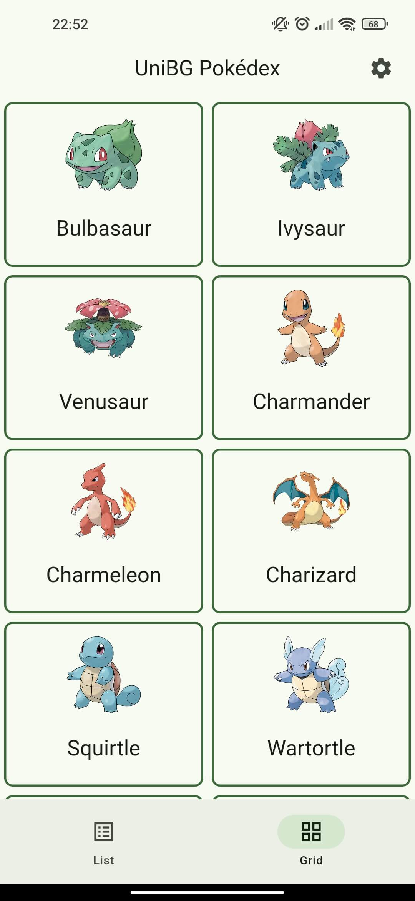 | 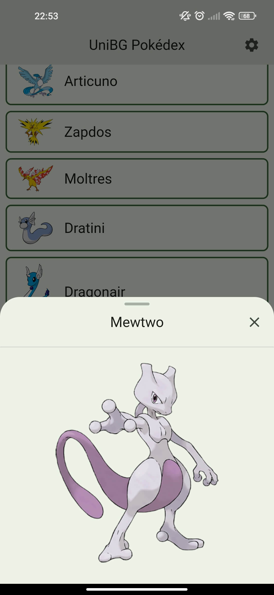 | 
| 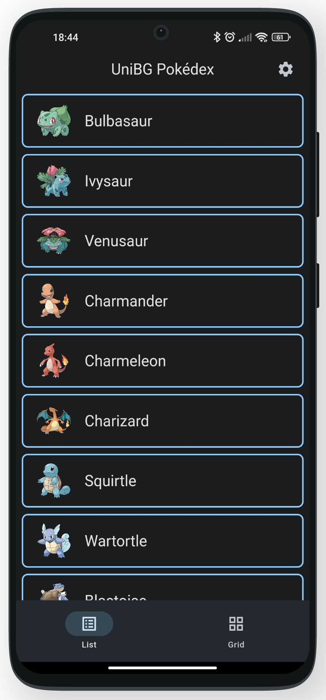 | 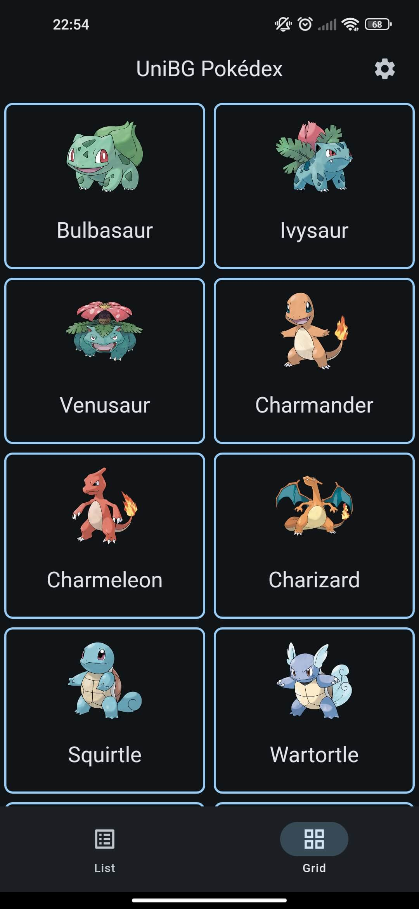 | 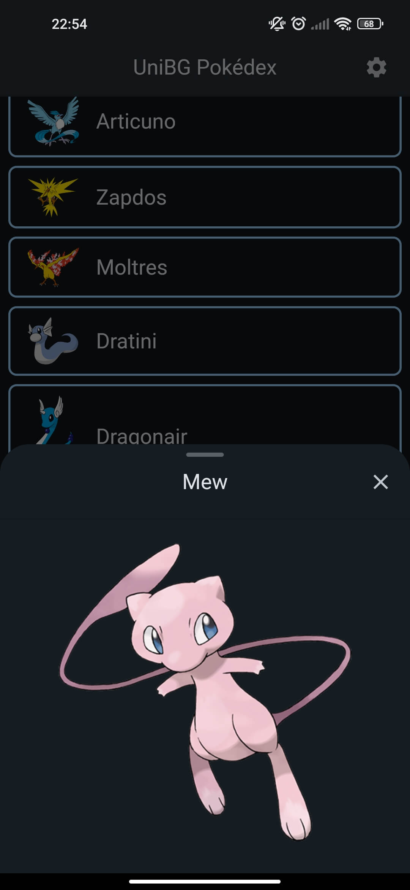 | 

| Single Page (1) | Single Page (2) | Settings |
|-|-|-|
| 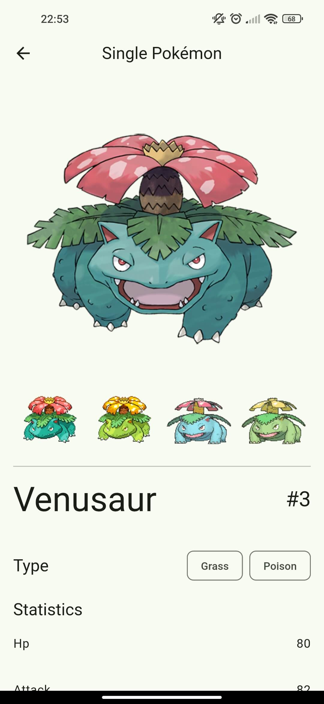 | 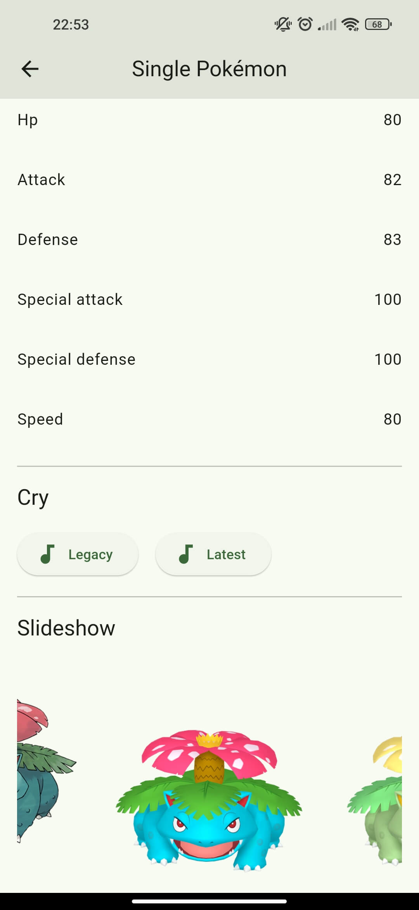 | 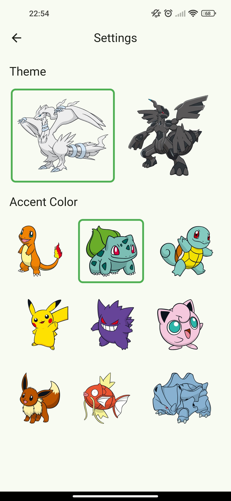 | 
| 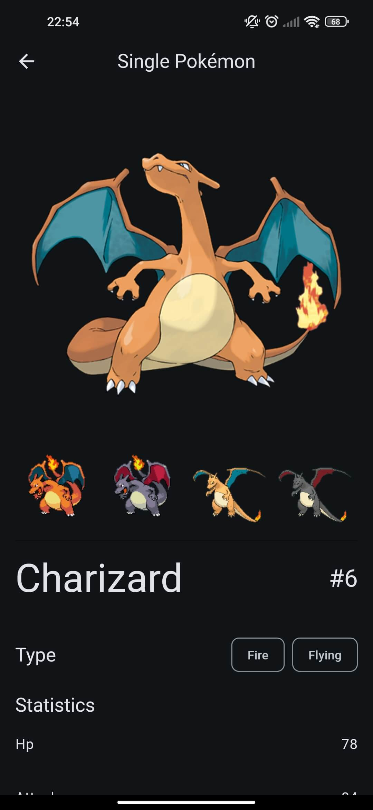 | 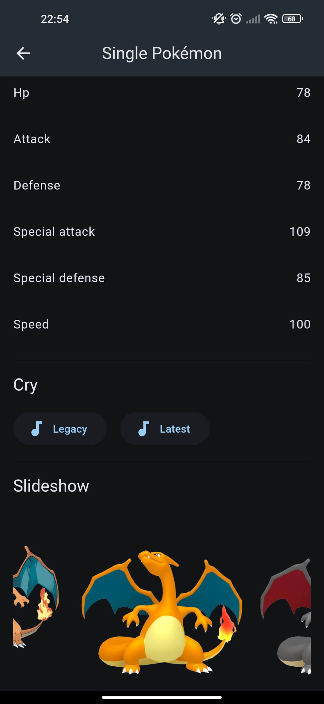 | 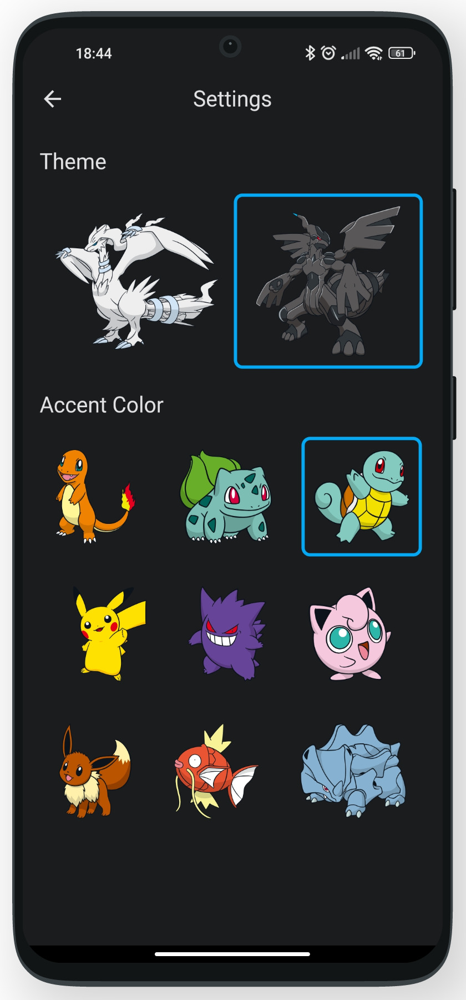 | 

## 🤖 AI Stuff

Artificial intelligence was used to create parts of the UI, in particular to generate:

* the description of the Pokémon
* the information about the Pokèmon with which it is favoured
* the information about the Pokèmon you are disadvantaged with
* the creation of the best team given the chosen Pokémon

All these prompts and system instructions can be found in files `/lib/service/kprompts.dart` and `/lib/service/ai_service.dart`. The AI service used is Gemini, the configuration of which was done following these guides:

* [Gemini API using Vertex AI in Firebase](https://firebase.google.com/docs/vertex-ai)
* [Get started with the Gemini API using the Vertex AI in Firebase SDKs](https://firebase.google.com/docs/vertex-ai/get-started)

All the configurations for Firebase and Vertex AI are in files `firebase.json`, `android/app/google-services.json` and `firebase_options.dart` that are not under version control. For the model I use `gemini-2.0-flash-lite-001`, more on other models here: [https://firebase.google.com/docs/vertex-ai/models](https://firebase.google.com/docs/vertex-ai/models)

## 💎 Contributing

If you have any idea, feel free to fork it and submit your changes back to me.

## 📋 License

UniBG Pokédex is released under the [MIT license](LICENSE.md). You can use the code for any purpose, including commercial projects.

[](https://opensource.org/licenses/MIT)